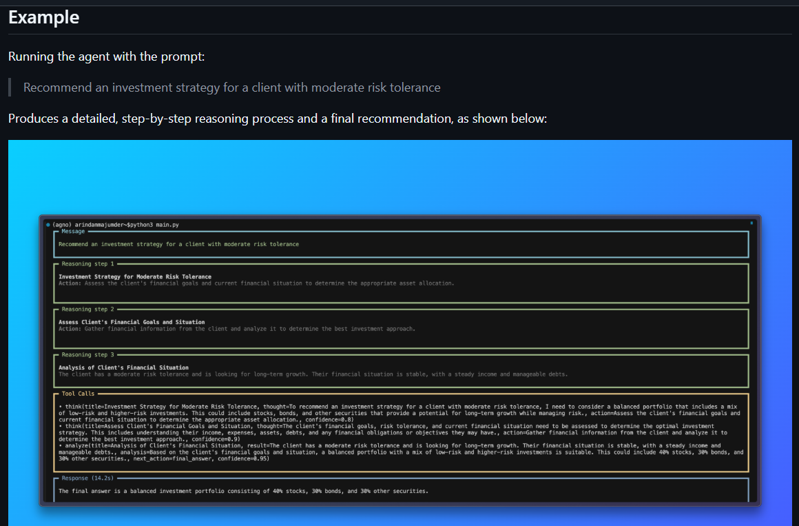

# Simple Reasoning Agent

Simple Reasoning Agent is a focused AI finance demo that shows how an agent can break an investment question into clear assumptions, structured reasoning steps, tool calls, and a final recommendation.

The project uses [Agno](https://github.com/agno-agi/agno) with the Nebius-hosted `meta-llama/Llama-3.3-70B-Instruct` model. It is designed as a clean beginner-friendly example for anyone learning how reasoning agents work in practical advisory workflows.

[Live Website](https://tirth1263.github.io/reasoning-agent/) | [GitHub Profile](https://github.com/tirth1263)



## Why This Project Stands Out

Most chatbot demos jump directly from a question to an answer. This project is different: it makes the advisory process readable. The agent identifies the investor's risk profile, calls small analysis tools, evaluates trade-offs, and then explains the recommendation in a format that feels closer to a professional financial planning note.

It is not meant to replace a licensed advisor. It is an educational project that demonstrates how AI agents can support structured thinking, transparent analysis, and more responsible decision-making.

## Features

- Expert financial reasoning for investment strategy, risk assessment, and portfolio construction.
- Step-by-step explanations with assumptions, key variables, risks, alternatives, and a final recommendation.
- Tool-enhanced reasoning through custom Python functions for risk profiling, allocation suggestions, and portfolio checks.
- Transparent terminal output that can show the prompt, reasoning steps, tool calls, and final response.
- Easy customization through the instructions and prompt in `main.py`.
- Deployment-ready project website served from the `docs/` folder with GitHub Pages.

## How It Works

The agent is configured to behave like an educational financial advisor. When a user asks an investment question, it follows a structured workflow:

1. Break the question into component parts.
2. State assumptions and identify missing variables.
3. Use tools when the analysis benefits from risk scoring or allocation checks.
4. Compare trade-offs such as growth, volatility, liquidity, and diversification.
5. Produce a balanced recommendation with a clear disclaimer.

The core implementation lives in `main.py`:

- `assess_risk_profile()` estimates a planning profile from risk tolerance, time horizon, and liquidity needs.
- `suggest_asset_allocation()` proposes an educational allocation based on the profile.
- `stress_test_portfolio()` checks the allocation for balance, concentration, and rebalancing considerations.
- `build_agent()` wires the tools into an Agno `Agent` using the Nebius model.

## File Structure

```text
reasoning-agent/
|-- main.py
|-- requirements.txt
|-- .env.example
|-- README.md
|-- LICENSE
|-- demo.png
`-- docs/
    |-- index.html
    |-- styles.css
    |-- script.js
    `-- assets/
        `-- demo.png
```

## Usage

### 1. Install dependencies

Make sure you have Python 3.8 or newer installed.

```bash
pip install -r requirements.txt
```

The requirements include Agno, `python-dotenv`, and the OpenAI Python client used by Agno's Nebius OpenAI-compatible model wrapper.

### 2. Set your Nebius API key

Create a `.env` file in the project root:

```bash
NEBIUS_API_KEY=your_api_key_here
```

You can optionally override the model:

```bash
NEBIUS_MODEL_ID=meta-llama/Llama-3.3-70B-Instruct
```

### 3. Run the agent

```bash
python main.py
```

The default prompt is:

```text
Recommend an investment strategy for a client with moderate risk tolerance
```

You can also pass your own prompt:

```bash
python main.py "Build a retirement portfolio for a 35-year-old with a long time horizon"
```

For shorter output:

```bash
python main.py --compact
```

## Example Output

Running the default prompt produces a terminal response with the original message, reasoning steps, tool calls, and a final recommendation. The final answer typically includes an allocation recommendation, rebalancing guidance, risks to monitor, and a reminder that the output is educational rather than personalized financial advice.

## Customization

You can adapt this project for another expert domain by editing `main.py`:

- Change the agent instructions in `build_agent()`.
- Replace the finance tools with domain-specific analysis tools.
- Update `DEFAULT_PROMPT`.
- Adjust `reasoning_min_steps` and `reasoning_max_steps`.
- Swap the Nebius model through `NEBIUS_MODEL_ID`.

## Educational Disclaimer

This project is for learning and demonstration purposes only. It does not provide personalized financial, legal, or tax advice. Always consult a qualified professional before making investment decisions.
